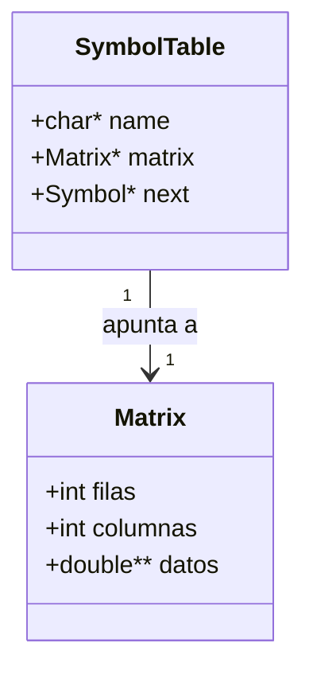

# Guía Exhaustiva: Calculadora de Matrices (Flex & Bison)

Esta calculadora es un traductor que procesa expresiones matemáticas de matrices utilizando **Flex** para el análisis léxico y **Bison** para el análisis sintáctico-semántico.

---

## 1. Arquitectura del Traductor

El proceso de traducción se divide en tres fases principales:

```mermaid
graph TD
    A[Entrada de texto .txt] -->|Flujo de caracteres| B(Análisis Léxico - Flex)
    B -->|Tokens: NUMERO, ID, +, -, *, [, ]| C(Análisis Sintáctico - Bison)
    C -->|Reglas Gramaticales| D{Análisis Semántico}
    D -->|Validar Dimensiones| E[Cálculo de Resultados]
    E -->|Salida| F[Consola: Matrices/Determinantes]
    D -->|Error de Dimensiones| G[Reporte de Error Semántico]
```

---

## 2. Análisis Léxico (Flex - `matcalc.l`)

El **Lexer** es el encargado de convertir el texto de entrada en **Tokens**.

### ¿Qué significan los componentes?
- **Tokens**: Son las unidades mínimas con significado (ej. `+`, `[`, `NUMERO`).
- **Expresiones Regulares**: Definen cómo reconocer cada token. Por ejemplo:
  - `NUMERO`: `-?([0-9]+(\.[0-9]+)?|\.[0-9]+)([eE][+-]?[0-9]+)?` (Soporta enteros, decimales y notación científica).
  - `IDENTIFICADOR`: `[a-zA-Z_][a-zA-Z0-9_]*` (Variables y nombres de funciones como `DET`).

### Integración con C y el Analizador Léxico
El lexer no solo reconoce texto, sino que envía valores a Bison a través de la unión `yylval`.

```c
/* Fragmento de matcalc.l */
{NUMERO}       {
    yylval.numero = atof(yytext); // Convierte string a double
    return NUMERO;               // Retorna el ID del Token
}

{IDENTIFICADOR} {
    if (strcmp(yytext, "DET") == 0) {
        return DET_FUNC;        // Reconoce palabras clave como funciones
    } else {
        yylval.identificador = strdup(yytext); // Copia el nombre para la tabla de símbolos
        return IDENTIFICADOR;
    }
}
```

---

## 3. Análisis Sintáctico (Bison - `matcalc.y`)

El **Parser** organiza los tokens según una **Gramática Libre de Contexto**.

### ¿Cómo corroboramos que una matriz está bien escrita?
La gramática define dos formas de escribir matrices. La clave está en la recursividad de las reglas y las validaciones intermedias.

#### A. Validación de Estructura (Sintaxis)
Bison verifica que los corchetes, comas y puntos y comas estén en el orden correcto.

```bison
/* Fragmento de matcalc.y: Regla para matrices planas */
matriz_plana:
    CORCHETE_IZQ lista_filas CORCHETE_DER {
        $$ = $2; // Si la estructura es [ filas ], es una matriz válida
    }

lista_filas:
    fila { $$ = $1; }
    | lista_filas PUNTO_COMA fila {
        /* Aquí ocurre la validación de consistencia (Semántica) */
        if ($1->columnas != $3->columnas) {
            fprintf(stderr, "Error: Inconsistencia en columnas...");
            error_en_sentencia = 1;
        }
        // ... Lógica para unir las filas ...
    }
```

#### B. Operaciones Matemáticas
Las operaciones se definen mediante la jerarquía de expresiones (`expr`).

```bison
/* Operaciones en matcalc.y */
expr:
    expr MAS expr {
        if (matrix_validate_add_sub($1, $3)) { // Validación semántica
            $$ = matrix_add($1, $3);           // Ejecución del cálculo
        }
        matrix_free($1); matrix_free($3);      // Limpieza de memoria
    }
    | DET_FUNC PARENT_IZQ expr PARENT_DER {
        if (matrix_validate_square($3)) {      // ¿Es cuadrada?
            double d = matrix_det($3);         // Calcula determinante
            $$ = matrix_create(1, 1);          // Retorna como escalar 1x1
            $$->datos[0][0] = d;
        }
        matrix_free($3);
    }
```

### Significado de los Símbolos Especiales
En Bison, las reglas se definen como `resultado: componente1 componente2...`.
- `$$`: Representa el valor semántico de la regla actual (el lado izquierdo o "padre").
- `$1, $2, $3...`: Representan el valor semántico de cada componente en el lado derecho (los "hijos" en el orden que aparecen).

### Gramática de Matrices
Se soportan dos tipos de entrada:
1. **Plana**: `[1, 2; 3, 4]` (Separado por `;` para filas y `,` para columnas).
2. **Anidada**: `[[1, 2], [3, 4]]` (Filas definidas como sub-listas).

### 3.1. Dualidad del Punto y Coma (`;`)
Una característica fundamental es cómo el `;` cambia su función según el contexto:

*   **Contexto de Matriz (Dentro de `[]`)**: Funciona como un **separador de filas**. El lexer detecta el token `PUNTO_COMA` y la gramática lo usa en la regla `lista_filas` para saltar a una nueva línea de datos.
    *   *Ejemplo*: `[1, 2; 3, 4]` -> El `;` indica que terminamos la primera fila y empezamos la segunda.
*   **Contexto de Sentencia (Fuera de `[]`)**: Funciona como un **delimitador de fin de instrucción**. Indica al intérprete que debe procesar toda la operación acumulada.
    *   *Ejemplo*: `A = [1; 2] + [3; 4];` -> El último `;` gatilla la regla `inst_completa`, imprimiendo el resultado final.

### 4.1. Verificación de Integridad de la Matriz
Antes de realizar cualquier cálculo, la calculadora asegura que la matriz esté **bien formada** (que sea rectangular). Esto se corrobora comparando dinámicamente el número de columnas de cada fila nueva con el de la primera fila procesada.

```bison
/* Fragmento de matcalc.y: Validación de dimensiones durante la creación */
lista_filas:
    fila { $$ = $1; }
    | lista_filas PUNTO_COMA fila {
        if ($1->columnas != $3->columnas) {
            /* Si la fila 2 tiene 3 columnas y la fila 1 tiene 2, la matriz es inválida */
            fprintf(stderr, "Error: Inconsistencia en el número de columnas por fila (%d vs %d)\n",
                    $1->columnas, $3->columnas);
            error_en_sentencia = 1; // Bloquea el cálculo posterior
            $$ = NULL;
        } else {
            // Si son iguales, se procede a fusionar las filas en una sola Matrix
        }
    }
```

### 4.2. Validación de Dimensiones en Operaciones (Suma y Resta)
Para las operaciones binarias como suma (`+`) o resta (`-`), se corrobora que ambas matrices tengan **dimensiones idénticas** ($m \times n$). Si los tamaños no coinciden, el sistema emite un error semántico y aborta el cálculo de esa expresión específica.

```c
/* Función de corroboración semántica en matcalc.y */
int matrix_validate_add_sub(Matrix* a, Matrix* b) {
    if (a->filas != b->filas || a->columnas != b->columnas) {
        fprintf(stderr, "Error semántico: Dimensiones incompatibles para operación +/-, %dx%d vs %dx%d\n",
                a->filas, a->columnas, b->filas, b->columnas);
        return 0; // La validación falla
    }
    return 1; // Las dimensiones son adecuadas
}
```

Esta separación garantiza que nunca se intente acceder a posiciones de memoria inexistentes durante el bucle de cálculo aritmético.

---

## 5. Implementación de Operaciones Fundamentales

Las operaciones matemáticas se ejecutan mediante funciones en C que manipulan la estructura `Matrix`.

### A. Suma de Matrices
Para sumar, primero validamos que las dimensiones sean idénticas y luego recorremos cada celda.

```c
/* Validación Semántica */
int matrix_validate_add_sub(Matrix* a, Matrix* b) {
    if (a->filas != b->filas || a->columnas != b->columnas) {
        fprintf(stderr, "Error: Dimensiones incompatibles para +/-, %dx%d vs %dx%d\n",
                yylineno, a->filas, a->columnas, b->filas, b->columnas);
        return 0; // Invalida la operación
    }
    return 1;
}

/* Ejecución del Cálculo */
Matrix* matrix_add(Matrix* a, Matrix* b) {
    Matrix* resultado = matrix_create(a->filas, a->columnas);
    for (int i = 0; i < a->filas; i++) {
        for (int j = 0; j < a->columnas; j++) {
            resultado->datos[i][j] = a->datos[i][j] + b->datos[i][j];
        }
    }
    return resultado;
}
```

### B. Multiplicación (Matricial y Escalar)
La calculadora es inteligente: si detecta que uno de los operandos es una matriz $1 \times 1$, realiza una multiplicación escalar automáticamente.

```c
Matrix* matrix_mul(Matrix* a, Matrix* b) {
    /* Caso: Producto Escalar (A es 1x1) */
    if (a->filas == 1 && a->columnas == 1) {
        double scalar = a->datos[0][0];
        // Multiplica cada elemento de B por el escalar...
    }
    
    /* Caso: Multiplicación de Matrices Estándar */
    Matrix* resultado = matrix_create(a->filas, b->columnas);
    for (int i = 0; i < a->filas; i++) {
        for (int j = 0; j < b->columnas; j++) {
            double suma = 0.0;
            for (int k = 0; k < a->columnas; k++) {
                suma += a->datos[i][k] * b->datos[k][j];
            }
            resultado->datos[i][j] = suma;
        }
    }
    return resultado;
}
```

### C. Determinante (Recursivo)
El determinante utiliza el método de expansión por cofactores (Laplace), reduciendo la matriz progresivamente.

```c
double matrix_det(Matrix* m) {
    if (m->filas == 1) return m->datos[0][0];
    if (m->filas == 2) {
        return (m->datos[0][0] * m->datos[1][1]) - (m->datos[0][1] * m->datos[1][0]);
    }
    // Para n > 2, se crean submatrices (menores) y se aplica recursividad...
}
```

---

## 5. Análisis Semántico y Validaciones

Aquí es donde se verifica que las operaciones tengan sentido matemático. A diferencia de la sintaxis (que solo mira la estructura `[ ]`), la semántica mira el **contenido** (las dimensiones).

### ¿Dónde se validan las dimensiones?
Las validaciones ocurren dentro de las acciones de Bison en `matcalc.y`, invocando funciones auxiliares:

1.  **Consistencia de Filas**: En la regla `lista_filas` y `lista_expresiones`.
    - *Lógica*: Si intentas crear `[1,2; 3]`, el programa detecta que la segunda fila tiene 1 columna mientras la primera tenía 2.
    - *Código*: `if ($1->columnas != $3->columnas) { ... error ... }`

2.  **Suma y Resta**: Función `matrix_validate_add_sub(a, b)`.
    - *Regla*: Las dimensiones deben ser idénticas ($m \times n$ con $m \times n$).

3.  **Multiplicación**: Función `matrix_validate_mul(a, b)`.
    - *Regla*: El número de columnas de $A$ debe ser igual al número de filas de $B$.
    - *Excepción*: Se permite **Producto Escalar** si una de las matrices es $1 \times 1$.

4.  **Determinante e Inversa**: Función `matrix_validate_square(m)`.
    - *Regla*: La matriz debe ser **cuadrada** ($n \times n$).

---

## 5. Control de Errores

El proyecto utiliza un sistema de **Modo Pánico** para no detener la ejecución ante un error:

- **Error Léxico**: El lexer detecta un carácter extraño, imprime el error, marca `error_en_sentencia = 1` y sigue tokenizando.
- **Error Sintáctico**: Bison detecta una estructura inválida (ej. `[[1,2]`), entra en la regla `error PUNTO_COMA`, limpia la pila y espera a la siguiente línea.
- **Error Semántico**: Se detecta en la validación de dimensiones. Se imprime un mensaje explicativo y se bloquea el cálculo para esa línea específica.

---

## 6. Visualización del Árbol de Derivación (Modo Debug)

La calculadora incluye un motor de trazado que genera una representación visual del árbol de sintaxis abstracta (AST) en la consola cuando se activa el modo depuración.

### ¿Cómo funciona el rastreo?
Se utiliza una variable global `profundidad` para controlar la indentación y una función `imprimir_debug` que se invoca en cada regla gramatical.

```c
/* Lógica de indentación en matcalc.y */
void imprimir_debug(const char* texto_token, const char* tipo_token) {
    if (!modo_debug || silenciar_traza) return;
    for (int i = 0; i < profundidad; i++) {
        printf("  "); // Indenta según el nivel jerárquico
    }
    printf("|-- %s (%s)\n", texto_token, tipo_token);
}
```

### Ejemplo de Construcción del Árbol
Cuando el parser reconoce una operación, incrementa la profundidad antes de procesar los hijos y la decrementa al terminar, creando una estructura visual de "padres e hijos":

```bison
expr: expr MAS expr {
    imprimir_debug("+", "OPERADOR_MAS");
    profundidad++; // Baja un nivel para los operandos
    
    /* ... validación y cálculo ... */
    
    profundidad--; // Sube tras procesar la rama
}
```

### Ejemplo de Salida en Consola
Para la expresión `A + [1, 2; 3, 4];`, el árbol se vería así:
```text
|-- INSTRUCCION (REGLA)
  |-- + (OPERADOR_MAS)
    |-- A (ID)
    |-- [ (CORCHETE_IZQ)
      |-- FILA (REGLA)
        |-- 1.00 (NUMERO)
        |-- 2.00 (NUMERO)
      |-- ; (PUNTO_COMA_FILA)
      |-- FILA (REGLA)
        |-- 3.00 (NUMERO)
        |-- 4.00 (NUMERO)
    |-- ] (CORCHETE_DER)
|-- ; (PUNTO_COMA)
```

---

## 7. Diagrama de la Estructura de Datos

El motor utiliza una estructura dinámica en C:



Cada matriz es un puntero a un array de punteros (`double**`), permitiendo tamaños arbitrarios definidos en tiempo de ejecución.